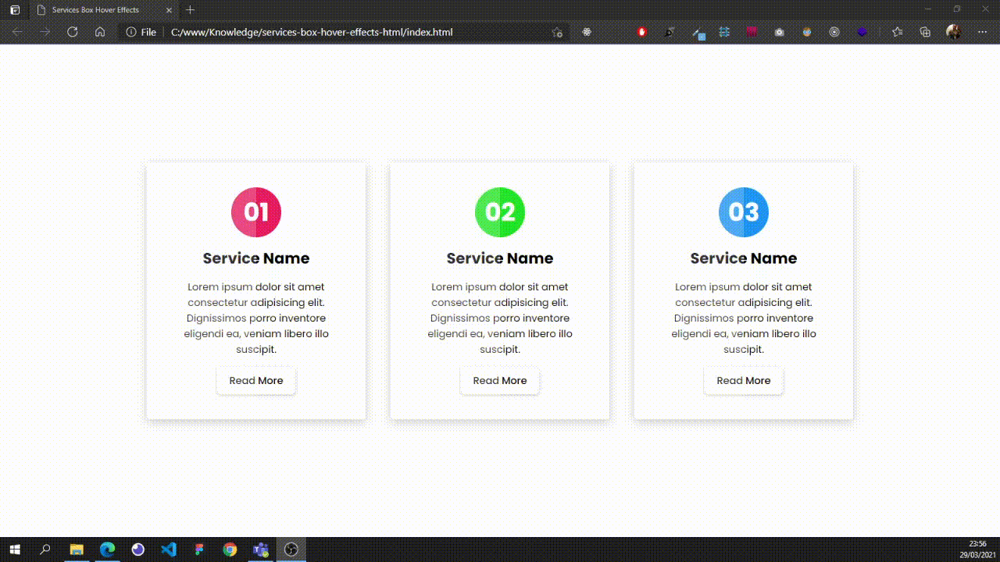

# Services Box Hover Effects

## About the project

Project done to apply the basic concepts of the main languages of web development, being markup and styling.

## Web Preview

## Technology

Project developed with:

- [HTML5](https://developer.mozilla.org/pt-BR/docs/Web/HTML)
- [CSS3](https://developer.mozilla.org/pt-BR/docs/Web/CSS)

## To run

The Visual Studio Code [Live Server](https://marketplace.visualstudio.com/items?itemName=ritwickdey.LiveServer) extension was used to open the project.
